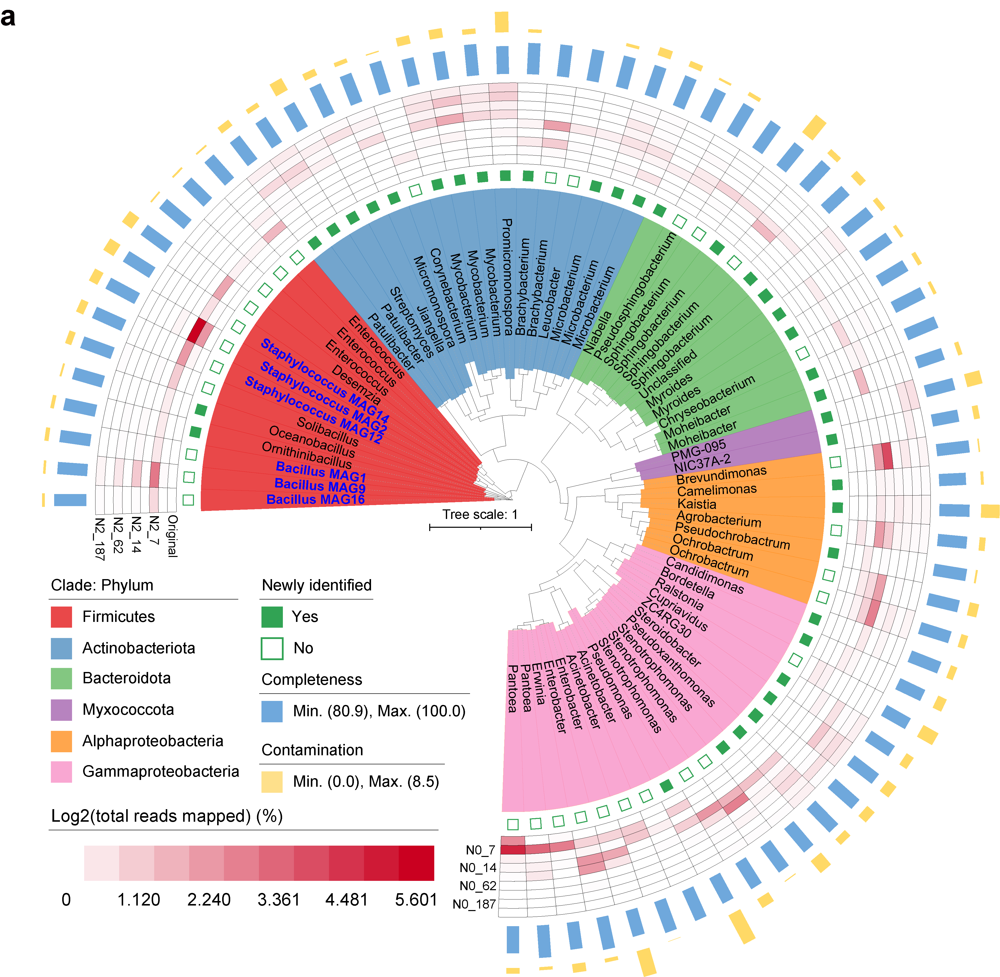

```{r setup, include=FALSE}
knitr::opts_chunk$set(
  collapse = TRUE,
  comment = "#>")
```

# Fig. 3a

```{r}
#The annotation of phylogenetic tree were conducted by the script table2itol.R
#Rscript table2itol/table2itol.R -a -c double -D plan1 -b Phylum -i Bin_name -l Genus -t %s -w 0.5 annotation.txt 
#Rscript table2itol/table2itol.R -a -c double -D plan1.1 -b Family -i Bin_name -l Genus -t %s -w 0.5 annotation.txt 
#Rscript table2itol/table2itol.R -a -d -c none -D plan2 -b Phylum -i Bin_name -l Genus -t %s -w 0.5 anno_complete.txt
#Rscript table2itol/table2itol.R -c keep -D plan3 -i Genome -t %s abundance.txt

#Based on the my.tree and annotation result, the phylogenetic tree visualized using interactive Tree of Life (iTOL) online.
```


# Fig. 3b

```{r}
library(ggplot2)

#data
data<-read.csv("cazy_kegg_sugar.csv",header = T,row.names=1,sep = ",")
data$Taxa<-factor(data$Taxa,levels=c("Bacillus","Staphylococcus"), labels = c("Bacillus","Staphylococcus"))

p1=ggplot(data=data,aes(x=Taxa,y=Number))+geom_col(aes(fill=Taxa),position = position_dodge(0.7),width = 0.7,show.legend = T)+theme_classic()+theme(axis.text.x = element_text(angle = 45, hjust = 1))+ scale_fill_manual(values=c("#1A9850","#D73027"))+facet_wrap( ~ Group,scales="free_y", ncol=2)
p1

width =80
height = 60
group="CAZy_sugar"
ggsave(paste0("",group,".pdf"), p1, width = width, height = height,units = "mm")
```

# Fig. 3c

```{r}
library(pheatmap)
library(reshape2)

#data
cazy<-read.csv("cazy.csv",header = T,row.names=1,sep = ",")
row<-read.csv("row.csv",header = T,row.names=1,sep = ",")
col<-read.csv("col.csv",header = T,row.names=1,sep = ",")

# Draw heatmaps
pheatmap(cazy,color = colorRampPalette(c("white", "#238B45"))(50),cluster_rows = FALSE,cluster_cols =FALSE,display_numbers =TRUE,number_color="black",number_format = "%.0f",fontsize_number = 8,annotation_col = col,annotation_row=row)

#Further refinement of the image can be manually modified in Adobe Illustrator.
```


