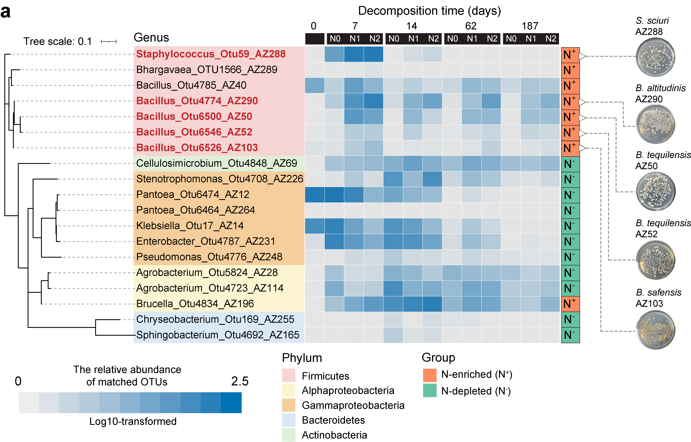

```{r setup, include=FALSE}
knitr::opts_chunk$set(echo = TRUE)
options(knitr.duplicate.label = "allow")
```

# Fig. 4a

```{r tree cars}
#Based on the tree and iTOL data, the phylogenetic tree visualized using interactive Tree of Life (iTOL) online.
```


# Fig. 4b

```{r pie plot}
library(ggplot2)
library(tidyverse)

#data
data = read.table("pie_data.csv", header = T, row.names=1,sep = ",")
data$Time<-factor(data$Time,levels=c("W0", "W7","W14","W62","W187"), labels = c("W0", "W7","W14","W62","W187"))
data$Group<-factor(data$Group,levels=c("Non-matching","Matching"), labels = c("Non-matching","Matching"))

#plot
p=ggplot(data, aes(x = "", y = Value, fill = Group))+geom_col(color = "white")+scale_fill_brewer(palette = "Set3") + 
  coord_polar("y", start = 0)+facet_wrap(~Time,ncol=1,nrow=5)+theme_void() + 
  theme(strip.text = element_text(size = 16),legend.position = c(2, 0.3))+scale_fill_manual(values=c("#BABABA","#257BB5"))
p

group="Matching abundance"
width = 300
height = 120
ggsave(paste0("pie",group,".pdf"), p, width = width, height = height,units = "mm")
ggsave(paste0("pie",group,".JPEG"), p, width = width, height = height,units = "mm")
```

# Fig. 4c-d

```{r decomposed residue}
library(ggplot2)
library(cowplot)

#decomposition rate of single strain
rate<-read.csv("single_strain.csv",row.names = 1)
mean<-aggregate(rate[,2],by=list(rate[,1]),FUN=mean)
rownames(mean)<-mean[,1]
sd<-aggregate(rate[,2],by=list(rate[,1]),FUN=sd)
rownames(sd)<-sd[,1]
data<-cbind(mean,sd)
data<-data[,-3]
colnames(data)<-c("Treatment","Mean","Se")

data$Treatment<-factor(data$Treatment,levels=c("Control","AZ40","AZ50","AZ52","AZ103","AZ290","AZ289","AZ288","AZ196","AZ14","AZ255","AZ165","AZ69","AZ69","AZ12","AZ231","AZ264","AZ226","AZ114","AZ28","AZ248"), labels =c("Control","AZ40","AZ50","AZ52","AZ103","AZ290","AZ289","AZ288","AZ196","AZ14","AZ255","AZ165","AZ69","AZ69","AZ12","AZ231","AZ264","AZ226","AZ114","AZ28","AZ248"))
rate$Treatment<-factor(rate$Treatment,levels=c("Control","AZ40","AZ50","AZ52","AZ103","AZ290","AZ289","AZ288","AZ196","AZ14","AZ255","AZ165","AZ69","AZ69","AZ12","AZ231","AZ264","AZ226","AZ114","AZ28","AZ248"), labels =c("Control","AZ40","AZ50","AZ52","AZ103","AZ290","AZ289","AZ288","AZ196","AZ14","AZ255","AZ165","AZ69","AZ69","AZ12","AZ231","AZ264","AZ226","AZ114","AZ28","AZ248"))

#plot
p1=ggplot()+geom_bar(data=data,mapping=aes(x=Treatment,y=Mean,fill=Treatment),size = 1.2,alpha=1,position="dodge", stat="identity",width = 0.8)+       scale_color_manual(values=c("#999999","#D9EF8B","#A6D96A","#66BD63","#1A9850","#006837","#E0E0E0","#BF812D","#E0E0E0","#E0E0E0","#E0E0E0","#E0E0E0","#E0E0E0","#E0E0E0","#E0E0E0","#E0E0E0","#E0E0E0","#E0E0E0","#E0E0E0","#E0E0E0"))+  scale_fill_manual(values=c("#999999","#D9EF8B","#A6D96A","#66BD63","#1A9850","#006837","#E0E0E0","#BF812D","#E0E0E0","#E0E0E0","#E0E0E0","#E0E0E0","#E0E0E0","#E0E0E0","#E0E0E0","#E0E0E0","#E0E0E0","#E0E0E0","#E0E0E0","#E0E0E0"))+ geom_errorbar(data=data,aes(x = Treatment,ymin = Mean-Se, ymax = Mean+Se,color=Treatment), width = 0.3,size=0.5)+geom_jitter(data=rate,mapping=aes(x=Treatment,y=Rate),color="black",size = 0.5,height = 0.02,width = 0.2)+theme_classic()+ labs(y="Decomposed residue (%)", x="")+  theme(panel.grid.major=element_blank(),panel.grid.minor=element_blank())+  theme(axis.text=element_text(colour='black',size=11))+theme(axis.text.x = element_text(angle = 45, hjust = 1))+ylim(0,52)+theme(legend.position = "none")
p1

#Interaction between decomposers and AZ288
rate<-read.csv("interaction.csv",row.names = 1)
rate$Treatment<-factor(rate$Treatment,levels=c("AZ50+autoclaved AZ288","AZ50+AZ288","AZ52+autoclaved AZ288","AZ52+AZ288","AZ290+autoclaved AZ288","AZ290+AZ288","AZ103+autoclaved AZ288","AZ103+AZ288"), labels =c("AZ50+autoclaved AZ288","AZ50+AZ288","AZ52+autoclaved AZ288","AZ52+AZ288","AZ290+autoclaved AZ288","AZ290+AZ288","AZ103+autoclaved AZ288","AZ103+AZ288"))

p2 <- ggplot(rate, aes(x=Treatment, y=Rate, color=Treatment)) + geom_boxplot(width=0.8,outlier.size = 0.2)+
theme(panel.background = element_rect(colour = "black"))+theme(legend.title=element_text(size=7),legend.text=element_text(size=7))+
  theme(legend.position='right',legend.key.size = unit(0.3,'cm'))+
  theme(panel.grid.major=element_blank(),panel.grid.minor=element_blank())+
  theme(axis.title.y= element_text(size=10))+theme(axis.title.x = element_text(size = 10))+
  theme(axis.text.x = element_text(size = 7),axis.text.y = element_text(size = 7))+
  xlab("")+ylab("Decomposed residue (%)")+
  theme(axis.text.x = element_text(angle = 0, hjust = 1))+geom_jitter(width = 0.2,aes(color=Treatment),size=0.7,alpha=0.7)+
  scale_fill_manual(values=c("white","white","white", "white","white","white", "white","white"))+
 scale_color_manual(values=c("#1A9850","#BF812D","#1A9850","#BF812D","#1A9850","#BF812D","#1A9850","#BF812D"))+theme_classic()+theme(axis.text.x = element_text(angle = 45, hjust = 1))+ylim(0,52)
p2

all_plot <- plot_grid(p1,p2,ncol = 2,nrow=1,align ="h",rel_widths = c(2,2))
all_plot
group="Fig. 4c-d"
width = 280
height = 100
ggsave(paste0("",group,".pdf"), all_plot, width = width, height = height,units = "mm")
ggsave(paste0("",group,".JPEG"), all_plot, width = width, height = height,units = "mm")
```

# Fig. 4e-g

```{r rate and community structure}
library(ggplot2)
library(vegan)
library(permute)
library(lattice)
library(gtools)
library(ggalluvial)
library(cowplot)

#decomposition rate
rate<-read.csv("mix decomposer_decomposition rate.csv",row.names = 1)

group="Figure4e"
rate$Group<-factor(rate$Group,levels=c("AZ103+AZ290","AZ103","AZ290","SC1","SC2","SC3","SC1+AZ288","SC2+AZ288","SC3+AZ288"), labels =c("AZ103+AZ290","AZ103","AZ290","SC1","SC2","SC3","SC1+AZ288","SC2+AZ288","SC3+AZ288"))

p1 <- ggplot(rate, aes(x=Group, y=Rate, color=Group)) + geom_boxplot(width=0.8,outlier.size = 0.2)+
theme(panel.background = element_rect(colour = "black"))+theme(legend.title=element_text(size=7),legend.text=element_text(size=7))+
  theme(legend.position='right',legend.key.size = unit(0.3,'cm'))+
  theme(panel.grid.major=element_blank(),panel.grid.minor=element_blank())+
  theme(axis.title.y= element_text(size=10))+theme(axis.title.x = element_text(size = 10))+
  theme(axis.text.x = element_text(size = 7),axis.text.y = element_text(size = 7))+
  xlab(paste0(group))+ylab("Decomposed residue (%)")+
  theme(axis.text.x = element_text(angle = 0, hjust = 1))+geom_jitter(width=0.2,aes(color=Group),size=0.5,alpha=0.7)+
  scale_fill_manual(values=c("white","white","white","white","white","white", "white","white","white"))+
  scale_color_manual(values=c("#FDB462","#FDB462","#FDB462","#80B1D3","#80B1D3","#80B1D3","#FB8072","#FB8072","#FB8072"))+theme_classic()+ylim(30,50)
p1


#PCoA
distance_mat<-read.table("bray_curtis.txt",header = T, row.names=1)
design<-read.csv("metadata.csv",header = T,row.names=1,sep = ",")
idx = rownames(design) %in% colnames(distance_mat) 
sub_design = design[idx,] 
distance_mat = distance_mat[rownames(sub_design), rownames(sub_design)]

#Adonis analysis
# adonis <- adonis2(distance_mat~Treatment, sub_design, permutations = 999)
# adonis
# factor=adonis$aov.tab

#calculation
pcoa = cmdscale(distance_mat, k=3, eig=T)# kis dimension, 3 is recommended; eig is eigenvalues
points = as.data.frame(pcoa$points) #get coordinate string, format to data framme
colnames(points) = c("x", "y", "z") 
eig = pcoa$eig
points = cbind(points, sub_design[match(rownames(points), rownames(sub_design)), ])

group="bray"
points$Treatment<-factor(points$Treatment,levels=c("N_SC1","N_SC1+AZ288","NON_SC1","NON_SC1+AZ288"), labels =c("N_SC1","N_SC1+AZ288","NON_SC1","NON_SC1+AZ288"))

p2 = ggplot(points, aes(x=x, y=y))+ geom_point(size=3,alpha=0.6,aes(color=Treatment))+ 
  labs(x=paste("PCoA 1 (", format(100 * eig[1] / sum(eig), digits=4), "%)", sep=""),y=paste("PCoA 2 (", format(100 * eig[2] / sum(eig), digits=4), "%)",sep=""))+theme(panel.background = element_rect(colour = "black"))+
theme(panel.grid.major=element_blank(),panel.grid.minor=element_blank())+
 theme(axis.text.x = element_text(size = 8),axis.text.y = element_text(size = 8))+
   theme(axis.title.y= element_text(size=10))+theme(axis.title.x = element_text(size = 10))+
  theme(legend.title=element_text(size=10),legend.text=element_text(size=8))+theme(plot.title = element_text(size = 10))+scale_color_manual(values=c("#FDB462","#80B1D3","#B3DE69","#AF8DC3"))+theme_classic()
p2


#relative abundance
data=read.csv("otu_norm.csv",header = T,row.names=1,sep = ",")

data$Treatment<-factor(data$Treatment,levels=c("SC1","SC1+AZ288"), labels =c("SC1","SC1+AZ288"))
data$Group<-factor(data$Group,levels=c("AZ50","AZ52","AZ103","AZ290","AZ288"), labels =c("AZ50","AZ52","AZ103","AZ290","AZ288"))

#绘图
p3 <- ggplot(data, aes(x=Treatment,y=RA,fill=Group,stratum=Group,alluvium=Group)) +
geom_stratum() +geom_flow(alpha = 0.5) +facet_wrap(~Treat, scales = 'free_x', ncol = 2) + 
labs(x = '', y = 'Relative abundance(%)')+theme_classic()+scale_fill_manual(values=c("#FFE699","#FFEFDB","#8FAADC","#FB8072","#878787"))
p3

all_plot <- plot_grid(p1,p2,p3,ncol = 3,nrow=1,align ="hv",rel_widths = c(2,1.9,2))
all_plot
group="Fig.4e-g"
width = 320
height = 80
ggsave(paste0("",group,".pdf"), all_plot, width = width, height = height,units = "mm")
ggsave(paste0("",group,".JPEG"), all_plot, width = width, height = height,units = "mm")
```

