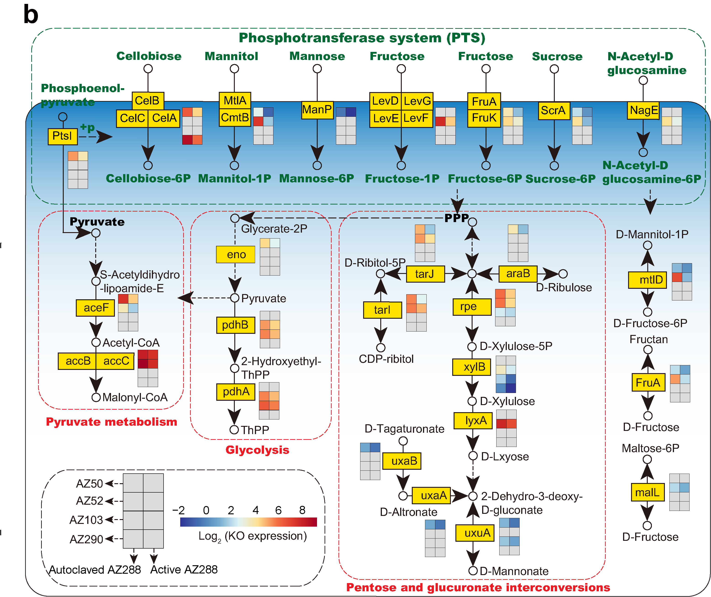

```{r setup, include=FALSE}
knitr::opts_chunk$set(echo = TRUE)
options(knitr.duplicate.label = "allow")
```

# Fig. 5a

```{r KEGG}
library(ggplot2)

data1=read.csv("KEGG_enrichment.csv",header = T,row.names=1,sep = ",")
data1$Strain<-factor(data1$Strain,levels=c("AZ50","AZ52","AZ103","AZ290"), labels =c("AZ50","AZ52","AZ103","AZ290"))

kegg=ggplot(data1,aes(x=Pathway,y=Rich_factor,color=Rich_factor))+
  geom_point(stat = "identity",aes(size=Gene_num))+
  geom_segment(aes(y=0,yend=Rich_factor,x=Pathway,xend=Pathway))+
  ylim(-0.01,1)+coord_flip()+theme_bw()+
  theme(panel.grid.major=element_blank(),panel.grid.minor=element_blank())+
  scale_color_gradient(low="#6495ED",high="#D73027")+
  geom_hline(yintercept = 0, linetype="dashed",color = "black", size=0.5)+facet_wrap( ~ Strain, ncol=4)+theme_classic()
kegg

group="KEGG_enrichment"
width = 250
height = 100
ggsave(paste0("",group,".pdf"), kegg, width = width, height = height,units = "mm")
```

# Fig. 5b

```{r down gene heatmap}
library(pheatmap)

#data
data=read.delim('Kegg.txt', header = TRUE, row.names = 1, sep = '\t')
col=read.delim('kegg_col.txt', header = TRUE, row.names = 1, sep = '\t')
row=read.delim('Kegg_row.txt', header = TRUE, row.names = 1, sep = '\t')

# Draw heatmaps
pheatmap(log2(data),color = colorRampPalette(c("#313695","#4575B4","#74ADD1","#E0F3F8","#FEE090","#F46D43","#D73027","#A50026"))(100),cluster_rows = FALSE,cluster_cols =FALSE,number_color="black",annotation_col = col,annotation_row=row)

# Metabolic pathways involved in sugar utilization were manually illustrated in Adobe Illustrator.
```


# Fig. 5c

```{r}
library(pheatmap)

data = read.table("Metabolites.txt", header=T, row.names=1, sep="\t", comment.char="")

colgroup = read.table("Metabolites_col.txt", header=T, row.names=1, sep="\t", comment.char="")
rowgroup = read.table("Metabolites_row.txt", header=T, row.names=1, sep="\t", comment.char="")

# Draw heatmaps
pheatmap(data,color = colorRampPalette(c("white", "#1B7837"))(50),
         cluster_rows = FALSE,cluster_cols =FALSE,display_numbers =FALSE,
         number_color="black",fontsize_number = 8,annotation_col = colgroup,
         annotation_row=rowgroup)
```

# Fig. 5d-e

```{r growth and sugar addition}
library(ggplot2)
library(cowplot)

#Fig. 5d
data = read.table("Sugar.txt", header=T, row.names=1, sep="\t", comment.char="")

group="sugar-OD"
data$Strain<-factor(data$Strain,levels=c("AZ50_ns","AZ52_ns","AZ103_ns","AZ290_ns","AZ288_ns","AZ50","AZ52","AZ103","AZ290","AZ288"), labels =c("AZ50_ns","AZ52_ns","AZ103_ns","AZ290_ns","AZ288_ns","AZ50","AZ52","AZ103","AZ290","AZ288"))

data$Sugar<-factor(data$Sugar,levels=c("No-C","No-N","Glucose","Fructose","Mannose","Cellbiose"), labels =c("No-C","No-N","Glucose","Fructose","Mannose","Cellbiose"))

p1 <- ggplot(data, aes(x=Strain, y=OD)) + geom_boxplot(width=0.5,outlier.size = 0.01,alpha=0.5)+
theme(panel.background = element_rect(colour = "black"))+theme_bw()+theme(legend.title=element_text(size=6),legend.text=element_text(size=6))+
  theme(legend.position='right',legend.key.size = unit(0.4,'cm'))+
  
  theme(panel.grid.major =  element_line(size=0.1),panel.grid.minor = element_line(size = 0.1))+
  theme(axis.title.y= element_text(size=6))+theme(axis.title.x = element_text(size = 6))+
  theme(axis.text.x = element_text(size = 6),axis.text.y = element_text(size = 6))+
  xlab("Site")+ylab("OD 600 at 16 hour")+
  ggtitle(paste0(group))+theme(plot.title = element_text(size = 6))+geom_jitter(width = 0.2,aes(color=Sugar),size=1,alpha=0.7)+
  scale_fill_manual(values=c("white", "white","white", "white","white", "white","white", "white","white"))+scale_color_manual(values = c("#CCCCCC","#E5C494", "#4D9221","#DE77AE","#3288BD","#FDB462"))+theme_classic()+theme(axis.text.x = element_text(angle = 45, hjust = 1))
p1


#Fig. 5e
rate<-read.csv("sugar_addition.csv",row.names = 1)

group="sugar_addition"
rate$Group<-factor(rate$Group,levels=c("AZ50","AZ50+AZ288","AZ50+AZ288+Fru","AZ50+AZ288+Man","AZ50+AZ288+Cel","AZ52","AZ52+AZ288","AZ52+AZ288+Fru","AZ52+AZ288+Man","AZ52+AZ288+Cel","AZ103","AZ103+AZ288","AZ103+AZ288+Fru","AZ103+AZ288+Man","AZ103+AZ288+Cel","AZ290","AZ290+AZ288","AZ290+AZ288+Fru","AZ290+AZ288+Man","AZ290+AZ288+Cel","SC1","SC1+AZ288","SC1+AZ288+Fru","SC1+AZ288+Man","SC1+AZ288+Cel"), labels =c("AZ50","AZ50+AZ288","AZ50+AZ288+Fru","AZ50+AZ288+Man","AZ50+AZ288+Cel","AZ52","AZ52+AZ288","AZ52+AZ288+Fru","AZ52+AZ288+Man","AZ52+AZ288+Cel","AZ103","AZ103+AZ288","AZ103+AZ288+Fru","AZ103+AZ288+Man","AZ103+AZ288+Cel","AZ290","AZ290+AZ288","AZ290+AZ288+Fru","AZ290+AZ288+Man","AZ290+AZ288+Cel","SC1","SC1+AZ288","SC1+AZ288+Fru","SC1+AZ288+Man","SC1+AZ288+Cel"))
rate$Strain<-factor(rate$Strain,levels=c("AZ50","AZ52","AZ103","AZ290","SC1"), labels =c("AZ50","AZ52","AZ103","AZ290","SC1"))
rate$Treatment<-factor(rate$Treatment,levels=c("Monoculture","Coculture","Fru","Man","Cel"), labels =c("Monoculture","Coculture","Fru","Man","Cel"))

p2 <- ggplot(rate, aes(x=Treatment, y=Rate, color=Treatment)) + geom_boxplot(width=0.8,outlier.size = 0.2)+
theme(panel.background = element_rect(colour = "black"))+theme_bw()+theme(legend.title=element_text(size=7),legend.text=element_text(size=7))+
  theme(legend.position='right',legend.key.size = unit(0.3,'cm'))+
  theme(panel.grid.major=element_blank(),panel.grid.minor=element_blank())+
  theme(axis.title.y= element_text(size=10))+theme(axis.title.x = element_text(size = 10))+
  theme(axis.text.x = element_text(size = 7),axis.text.y = element_text(size = 7))+
  xlab(paste0(group))+ylab("Decomposed residue (%)")+ggtitle(paste0(group))+theme(axis.text.x = element_text(angle = 0, hjust = 1))+geom_jitter(width = 0.2,aes(color=Treatment),size=1,alpha=0.7)+scale_fill_manual(values=c("white","white","white"))+ggtitle(paste0(group))+scale_color_manual(values=c("#1A9850","#BF812D","#DE77AE","#3288BD","#FDB462"))+theme_classic()+ylim(5,55)+theme(axis.text.x = element_text(angle = 45, hjust = 1))+facet_grid(. ~ Strain)
p2


all_plot <- plot_grid(p1,p2,ncol = 2,nrow=1,align ="hv",rel_widths = c(1.4,2))
all_plot

group="Fig. 5d-e"
width = 300
height = 85
ggsave(paste0("",group,".pdf"), all_plot, width = width, height = height,units = "mm")
ggsave(paste0("",group,".JPEG"), all_plot, width = width, height = height,units = "mm")
```


